<p align="center">
  
</p>

<h1 align="center">🛍️ Fashion E-Commerce App</h1>

<p align="center">
  <strong>Ứng dụng thương mại điện tử thời trang đầy đủ tính năng được xây dựng bằng Flutter & Firebase</strong>
</p>

<p align="center">
  
  
  
  
</p>

<p align="center">
  
  
  
</p>

---

## 📋 Mục Lục

- [Giới Thiệu](#-giới-thiệu)
- [Screenshots](#-screenshots)
- [Tính Năng](#-tính-năng)
- [Công Nghệ Sử Dụng](#-công-nghệ-sử-dụng)
- [Kiến Trúc](#-kiến-trúc)
- [Thiết Kế Database](#-thiết-kế-database)
- [Cấu Trúc Dự Án](#-cấu-trúc-dự-án)
- [Cài Đặt & Chạy](#-cài-đặt--chạy)
- [Testing](#-testing)
- [Tác Giả](#-tác-giả)

---

## 🎯 Giới Thiệu

**Fashion E-Commerce App** là một ứng dụng thương mại điện tử hoàn chỉnh cho cửa hàng thời trang, được phát triển **độc lập từ đầu đến cuối** bao gồm:

- ✅ **Thiết kế Database** - Xây dựng schema Firestore với các collections liên kết
- ✅ **Backend Integration** - Firebase Authentication, Firestore, Storage, Cloud Messaging
- ✅ **Frontend Development** - 36+ màn hình UI/UX với Flutter
- ✅ **State Management** - Riverpod với code generation cho reactive programming
- ✅ **Real-time Features** - Chat hỗ trợ khách hàng, thông báo đẩy FCM
- ✅ **Testing** - Integration tests trên thiết bị thật
- ✅ **Deployment** - Build & deploy multi-platform

> 🏆 **Đây là dự án cá nhân (Solo Project)** - Tất cả các công việc từ thiết kế, phát triển, testing đến deployment đều được thực hiện bởi một người.

---

## 📱 Screenshots

### 👤 Customer App

<table>
  <tr>
    <td align="center">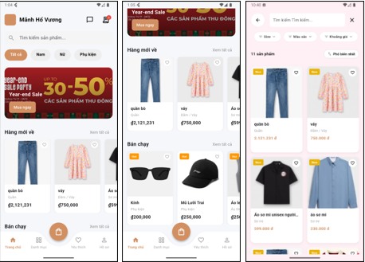<br/><b>Trang Chủ</b></td>
    <td align="center">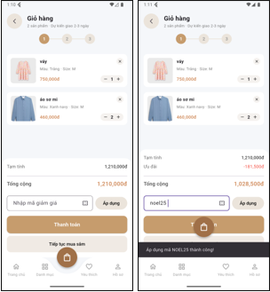<br/><b>Giỏ Hàng</b></td>
    <td align="center">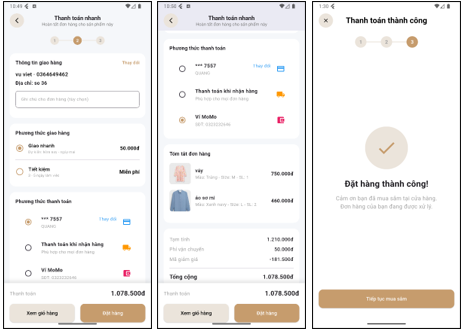<br/><b>Thanh Toán</b></td>
  </tr>
  <tr>
    <td align="center">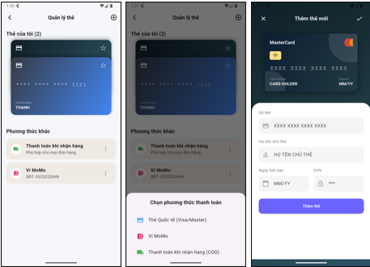<br/><b>Phương Thức TT</b></td>
    <td align="center">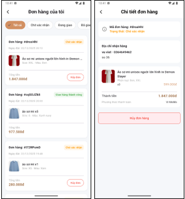<br/><b>Xem Đơn Hàng</b></td>
    <td align="center">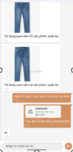<br/><b>Chat Hỗ Trợ</b></td>
  </tr>
</table>

### 👨‍💼 Admin Dashboard

<table>
  <tr>
    <td align="center">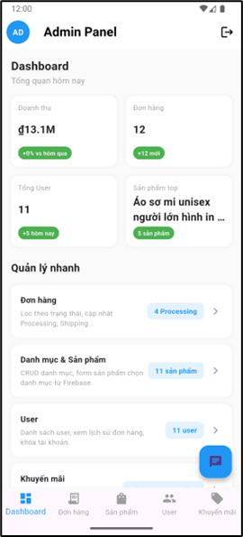<br/><b>Dashboard</b></td>
    <td align="center">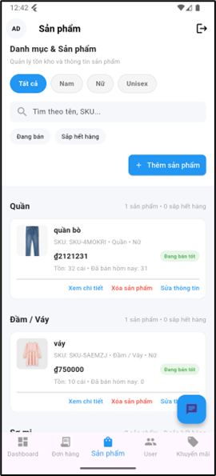<br/><b>Quản Lý Sản Phẩm</b></td>
    <td align="center">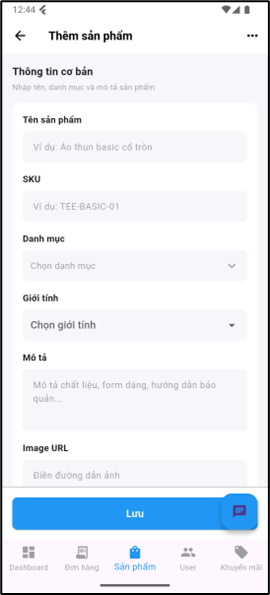<br/><b>Thêm Sản Phẩm</b></td>
  </tr>
  <tr>
    <td align="center">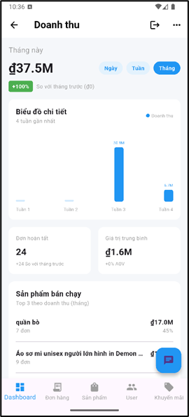<br/><b>Quản Lý Đơn Hàng</b></td>
    <td align="center">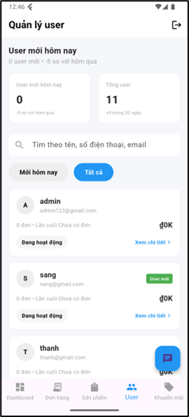<br/><b>Quản Lý Người Dùng</b></td>
    <td align="center">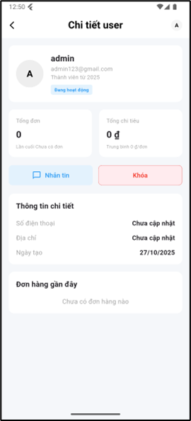<br/><b>Chi Tiết Người Dùng</b></td>
  </tr>
  <tr>
    <td align="center">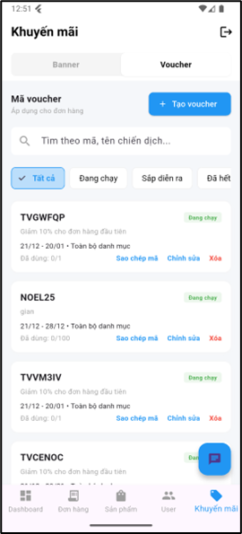<br/><b>Khuyến Mãi & Voucher</b></td>
    <td align="center">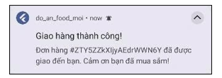<br/><b>Thông Báo Đẩy</b></td>
    <td></td>
  </tr>
</table>

---

## ✨ Tính Năng

### 🛒 Customer Features

| Tính Năng | Mô Tả |
|-----------|-------|
| **🔐 Authentication** | Đăng ký/Đăng nhập với Firebase Auth, xác thực email |
| **🏠 Product Browsing** | Duyệt sản phẩm theo danh mục, giới tính, tìm kiếm |
| **📦 Product Variants** | Hỗ trợ nhiều size, màu sắc với giá và tồn kho riêng |
| **🛒 Shopping Cart** | Thêm/xóa sản phẩm, cập nhật số lượng, kiểm tra tồn kho real-time |
| **💳 Checkout** | Quy trình thanh toán với thông tin giao hàng, ghi chú |
| **🎫 Voucher System** | Nhập mã giảm giá, voucher chào mừng tự động cho user mới |
| **📋 Order History** | Xem lịch sử đơn hàng, trạng thái giao hàng |
| **❤️ Wishlist** | Lưu sản phẩm yêu thích |
| **💬 Live Chat** | Chat real-time với admin để được hỗ trợ |
| **🔔 Push Notifications** | Nhận thông báo cập nhật đơn hàng qua FCM |
| **👤 Profile Management** | Cập nhật thông tin cá nhân, địa chỉ, số điện thoại |
| **💳 Payment Methods** | Quản lý phương thức thanh toán, thẻ đã lưu |

### 👨‍💼 Admin Features

| Tính Năng | Mô Tả |
|-----------|-------|
| **📊 Dashboard** | Tổng quan doanh thu, đơn hàng, sản phẩm bán chạy |
| **📦 Product Management** | CRUD sản phẩm với variants (size/color/price/stock) |
| **🖼️ Image Upload** | Upload ảnh sản phẩm lên Firebase Storage |
| **📋 Order Management** | Xem, cập nhật trạng thái đơn hàng |
| **👥 User Management** | Quản lý người dùng, xem chi tiết, lịch sử mua hàng |
| **🎫 Voucher Management** | Tạo/quản lý mã giảm giá với điều kiện |
| **🎨 Banner/Promotion** | Quản lý banner quảng cáo, khuyến mãi |
| **💬 Customer Support** | Trả lời chat từ khách hàng |
| **📈 Revenue Analytics** | Thống kê doanh thu, sản phẩm bán chạy |

### 🔔 Real-time Features

| Tính Năng | Chi Tiết Kỹ Thuật |
|-----------|-------------------|
| **Live Chat** | Firestore Streams + Real-time listeners |
| **Push Notifications** | Firebase Cloud Messaging (FCM) với HTTP v1 API |
| **Order Updates** | Thông báo tự động khi trạng thái đơn hàng thay đổi |
| **Stock Sync** | Transactions đảm bảo tính nhất quán tồn kho |

---

## 🛠 Công Nghệ Sử Dụng

### Frontend

| Công Nghệ | Mục Đích |
|-----------|----------|
| **Flutter 3.x** | Cross-platform UI framework |
| **Dart 3.x** | Programming language |
| **Riverpod 3.x** | State management với code generation |
| **Go Router** | Declarative routing |
| **Google Fonts** | Typography |
| **Cached Network Image** | Image caching & loading |
| **Flutter SVG** | SVG rendering |
| **intl** | Internationalization & number formatting |

### Backend & Services

| Công Nghệ | Mục Đích |
|-----------|----------|
| **Firebase Auth** | User authentication |
| **Cloud Firestore** | NoSQL database real-time |
| **Firebase Storage** | Image/file storage |
| **Firebase Cloud Messaging** | Push notifications |
| **HTTP/Dio** | Network requests |
| **googleapis_auth** | OAuth2 cho FCM HTTP v1 |

### Development Tools

| Công Cụ | Mục Đích |
|---------|----------|
| **build_runner** | Code generation |
| **riverpod_generator** | Auto-generate providers |
| **flutter_launcher_icons** | App icon generation |
| **integration_test** | E2E testing |

---

## 🏗 Kiến Trúc

### MVVM + Repository Pattern

```
┌─────────────────────────────────────────────────────────────────┐
│                         PRESENTATION                            │
│  ┌─────────────────────────────────────────────────────────┐    │
│  │                      VIEW (Screens)                      │    │
│  │   LoginScreen, HomeScreen, CartScreen, AdminDashboard    │    │
│  └─────────────────────────────────────────────────────────┘    │
│                              │                                   │
│                              ▼                                   │
│  ┌─────────────────────────────────────────────────────────┐    │
│  │                   VIEWMODEL (Providers)                  │    │
│  │   CartProvider, OrderProvider, ProductProvider           │    │
│  │   (Riverpod Notifiers with Code Generation)              │    │
│  └─────────────────────────────────────────────────────────┘    │
└─────────────────────────────────────────────────────────────────┘
                              │
                              ▼
┌─────────────────────────────────────────────────────────────────┐
│                         DATA LAYER                               │
│  ┌─────────────────────────────────────────────────────────┐    │
│  │                    SERVICES/REPOSITORIES                 │    │
│  │   AuthService, OrderRepository, ProductRepository        │    │
│  │   ChatService, NotificationService, VoucherRepository    │    │
│  └─────────────────────────────────────────────────────────┘    │
│                              │                                   │
│                              ▼                                   │
│  ┌─────────────────────────────────────────────────────────┐    │
│  │                       MODELS                             │    │
│  │   Product, Order, User, ChatMessage, Voucher, Banner     │    │
│  └─────────────────────────────────────────────────────────┘    │
└─────────────────────────────────────────────────────────────────┘
                              │
                              ▼
┌─────────────────────────────────────────────────────────────────┐
│                      FIREBASE BACKEND                            │
│   ┌──────────┐  ┌───────────┐  ┌─────────┐  ┌───────────────┐   │
│   │   Auth   │  │ Firestore │  │ Storage │  │ Cloud Messaging│   │
│   └──────────┘  └───────────┘  └─────────┘  └───────────────┘   │
└─────────────────────────────────────────────────────────────────┘
```

### State Management Flow

```
User Action → View → Provider (ViewModel) → Repository → Firebase
                                    │
                          State Update (Reactive)
                                    │
                                    ▼
                    UI Rebuilds via Riverpod Listeners
```

---

## 💾 Thiết Kế Database

### Firestore Collections

```
📁 Firestore Database
├── 📂 users
│   └── {userId}
│       ├── name: string
│       ├── email: string
│       ├── phoneNumber: string
│       ├── role: "User" | "Admin"
│       ├── fcmToken: string
│       ├── isNewUser: boolean
│       └── createdAt: timestamp
│
├── 📂 products
│   └── {productId}
│       ├── name: string
│       ├── category: string
│       ├── price: number
│       ├── stock: number
│       ├── imageUrl: string
│       ├── gender: "Nam" | "Nữ" | "Unisex"
│       ├── colors: string[]
│       ├── sizes: string[]
│       ├── description: string
│       └── variants: [
│           { color, size, price, stock, imageUrl, warningStock }
│       ]
│
├── 📂 orders
│   └── {orderId}
│       ├── userId: string
│       ├── customerName: string
│       ├── customerPhone: string
│       ├── customerAddress: string
│       ├── products: [{ productId, name, qty, price, size, color }]
│       ├── totalPrice: number
│       ├── status: "pending" | "confirmed" | "shipping" | "delivered" | "cancelled"
│       ├── paymentMethod: string
│       ├── note: string
│       └── createdAt: timestamp
│
├── 📂 vouchers
│   └── {voucherId}
│       ├── code: string
│       ├── type: "percent" | "amount"
│       ├── value: number
│       ├── minOrderValue: number
│       ├── maxDiscount: number
│       ├── startDate: timestamp
│       ├── endDate: timestamp
│       ├── usageLimit: number
│       ├── usedCount: number
│       └── isActive: boolean
│
├── 📂 chats
│   └── {userId}
│       ├── userName: string
│       ├── userEmail: string
│       ├── lastMessage: string
│       ├── lastMessageTime: timestamp
│       ├── isReadByAdmin: boolean
│       ├── isReadByUser: boolean
│       └── 📂 messages
│           └── {messageId}
│               ├── senderId: string
│               ├── text: string
│               ├── isAdmin: boolean
│               ├── isRead: boolean
│               └── timestamp: timestamp
│
└── 📂 banners
    └── {bannerId}
        ├── title: string
        ├── imageUrl: string
        ├── position: number
        ├── startDate: timestamp
        ├── endDate: timestamp
        ├── isActive: boolean
        └── clickCount: number
```

### Database Features

- ✅ **Transactions** - Đảm bảo tính nhất quán khi cập nhật stock
- ✅ **Real-time Streams** - Sử dụng Firestore snapshots cho dữ liệu live
- ✅ **Compound Queries** - Lọc và sắp xếp theo nhiều fields
- ✅ **Batch Operations** - Cập nhật nhiều documents cùng lúc

---

## 📁 Cấu Trúc Dự Án

```
lib/
├── main.dart                          # Entry point, Firebase init, Auth handler
├── firebase_options.dart              # Firebase configuration
│
├── Model/                             # Data Models
│   ├── chat_model.dart                # ChatMessage, ChatSession
│   ├── order_model.dart               # Order, OrderItem
│   ├── payment_method_model.dart      # PaymentMethod
│   ├── product_model.dart             # Product, ProductVariant
│   ├── promotion_model.dart           # BannerModel, VoucherModel
│   ├── user_model.dart                # UserModel
│   └── voucher_model.dart             # Voucher
│
├── Services/                          # Business Logic & API Calls
│   ├── auth_service.dart              # Firebase Auth operations
│   ├── chat_service.dart              # Real-time chat CRUD
│   ├── notification_service.dart      # FCM push notifications
│   ├── order_repository.dart          # Order CRUD with stock management
│   ├── product_repository.dart        # Product CRUD
│   ├── promotion_repository.dart      # Banner/Promotion CRUD
│   ├── user_repository.dart           # User profile operations
│   └── voucher_repository.dart        # Voucher validation & CRUD
│
├── ViewModel/                         # State Management (Riverpod)
│   ├── admin_provider.dart            # Admin state
│   ├── cart_provider.dart             # Cart state with stock validation
│   ├── favorite_provider.dart         # Wishlist state
│   ├── navigation_provider.dart       # Navigation state
│   ├── order_provider.dart            # Order state (+ generated .g.dart)
│   ├── product_provider.dart          # Product state (+ generated .g.dart)
│   ├── promotion_provider.dart        # Promotion state
│   └── user_provider.dart             # User state
│
└── View/                              # UI Screens
    ├── Widgets/                       # Reusable components
    └── Role_based_login/
        ├── User/                      # Customer screens
        │   ├── login_screen.dart
        │   ├── signup_screen.dart
        │   ├── user_main_screen.dart
        │   ├── Home/
        │   ├── Product/
        │   ├── Cart/
        │   ├── Checkout/
        │   ├── Profile/
        │   ├── Wishlist/
        │   └── Chat/
        │
        └── Admin/                     # Admin screens
            ├── admin_home_screen.dart
            ├── dashboard_screen.dart
            ├── add_edit_product_screen.dart
            ├── order_management_screen.dart
            ├── user_management_screen.dart
            ├── admin_voucher_screen.dart
            ├── promotion_management_screen.dart
            ├── admin_chat_list_screen.dart
            └── ...
```

---

## 🚀 Cài Đặt & Chạy

### Prerequisites

- Flutter SDK 3.x
- Dart SDK 3.x
- Firebase CLI
- Android Studio / VS Code
- Google Services files (google-services.json, GoogleService-Info.plist)

### 1. Clone Repository

```bash
git clone https://github.com/your-username/fashion-ecommerce-app.git
cd fashion-ecommerce-app
```

### 2. Install Dependencies

```bash
flutter pub get
```

### 3. Firebase Setup

1. Tạo project trên [Firebase Console](https://console.firebase.google.com/)
2. Enable Authentication (Email/Password)
3. Create Firestore Database
4. Enable Storage
5. Setup Cloud Messaging
6. Download và thêm config files:
   - `android/app/google-services.json`
   - `ios/Runner/GoogleService-Info.plist`

### 4. Generate Code

```bash
dart run build_runner build --delete-conflicting-outputs
```

### 5. Run App

```bash
# Development
flutter run

# Build APK
flutter build apk --release

# Build iOS
flutter build ios --release
```

---

## 🧪 Testing

### Integration Tests

Dự án bao gồm integration tests chạy trên thiết bị thật:

```bash
# Chạy integration tests
flutter test integration_test/app_test.dart
```

**Test Cases:**
- ✅ Kiểm tra validation form đăng ký (tên, số điện thoại)
- ✅ Hiển thị màn hình chi tiết sản phẩm
- ✅ Input formatters hoạt động đúng

---

## 👨‍💻 Tác Giả

<table>
  <tr>
    <td align="center">
      <b>Lương Đức Thành</b><br/>
      <i>Solo Developer</i><br/><br/>
      <b>Đóng góp:</b>
      <ul align="left">
        <li>🎨 UI/UX Design</li>
        <li>📐 Database Architecture</li>
        <li>⚙️ Backend Integration</li>
        <li>📱 Frontend Development</li>
        <li>🧪 Testing</li>
        <li>🚀 Deployment</li>
      </ul>
    </td>
  </tr>
</table>

---

## 📄 License

This project is for educational purposes.

---

<p align="center">
  <b>⭐ Nếu dự án hữu ích, hãy cho một star!</b>
</p>
